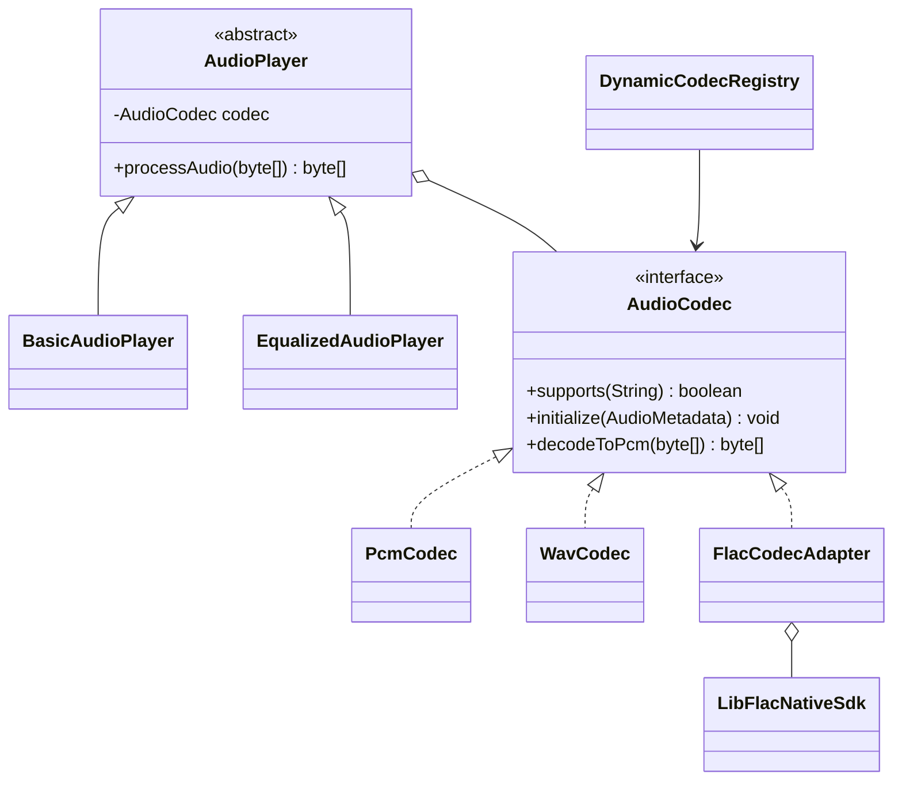

# Design rationale

## Domain
This project models audio players that decode different audio formats. A player can be basic or apply an equalizer preset, while the codec can vary independently.

## Patterns
**Bridge:** `AudioPlayer` holds an `AudioCodec`. `BasicAudioPlayer` and `EqualizedAudioPlayer` are refined abstractions. `PcmCodec`, `WavCodec`, and `FlacCodecAdapter` are implementations. A new player type or codec can be added without changing the existing hierarchy.

**Adapter:** `LibFlacNativeSdk` is not changed and does not implement `AudioCodec`. Its methods use a different API: configuration returns integer status codes, and decoding writes into a `short[]` output buffer using offset/length arguments. `FlacCodecAdapter` converts those calls and translates failures into `AudioCodecException`.

Bridge alone cannot make the native SDK conform to `AudioCodec`; Adapter alone would not separate player types from codec implementations.

## Required complexity module
Dynamic implementor selection: `DynamicCodecRegistry` selects a codec at runtime based on the input format.

## Limitation
The sample native SDK and WAV/PCM codecs are simplified demonstrations. A production decoder would need real decoding, stream handling, and richer metadata validation.

## UML

