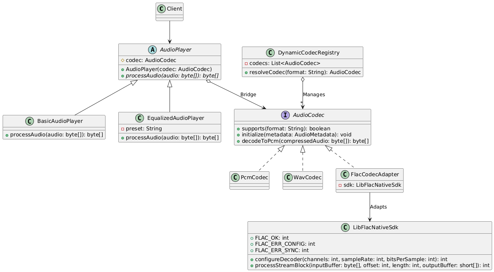

# Assignment 3: Bridge and Adapter Patterns (Audio System)

Individual project demonstrating the integration of **Bridge** and **Adapter** patterns within an audio decoding and playback domain, including runtime codec resolution.

---
## UML Diagram

## 1. Domain & Architecture Overview

The system processes audio streams by decoupling high-level playback behavior (player modes) from low-level decoding logic (codecs).

### Bridge Pattern
* **Abstraction:** `AudioPlayer` — high-level interface handling audio processing logic.
* **Refined Abstractions:**
  * `BasicAudioPlayer` — straightforward stream processing directly to PCM output.
  * `EqualizedAudioPlayer` — processes audio while applying sound equalizer presets.
* **Implementor:** `AudioCodec` — contract for audio format detection, decoder setup, and decompression.
* **Concrete Implementors:**
  * `PcmCodec` — passthrough codec for raw uncompressed PCM.
  * `WavCodec` — standard uncompressed/lightly-compressed wave decoder.

### Adapter Pattern
* **Adaptee:** `LibFlacNativeSdk` — a third-party, low-level native library. It is incompatible with our `AudioCodec` contract due to:
  * Different method names and signatures (`configureDecoder`, `processStreamBlock`).
  * Primitive output buffers (`short[]`) rather than `byte[]`.
  * Return status codes (`FLAC_OK`, `FLAC_ERR_CONFIG`, `FLAC_ERR_SYNC`) instead of exceptions.
* **Adapter:** `FlacCodecAdapter` — implements `AudioCodec`, wrapping `LibFlacNativeSdk`. It manages byte order buffers and converts SDK error return codes directly into domain-specific `AudioCodecException`s, keeping the abstraction isolated from third-party internals.

---

## 2. Complexity Module

* **Dynamic Implementor Selection:** `DynamicCodecRegistry` stores available `AudioCodec` instances and resolves the appropriate codec at runtime based on the requested format string (e.g., `"FLAC"`, `"WAV"`). The client code does not need to manually bind concrete codec implementations.

---

## 3. Testing

* **`AudioPlayerTest` (JUnit 5 + Mockito):**
  * Verifies normal delegation for both refined abstractions (`BasicAudioPlayer`, `EqualizedAudioPlayer`).
  * Verifies proper failure translation: tests that SDK error status codes are intercepted by `FlacCodecAdapter` and thrown as clean `AudioCodecException` instances.